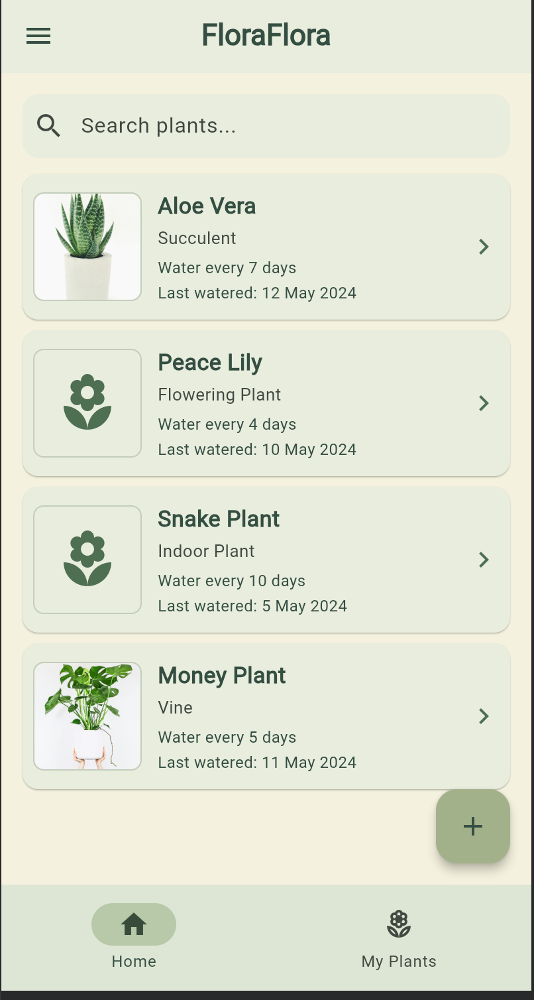
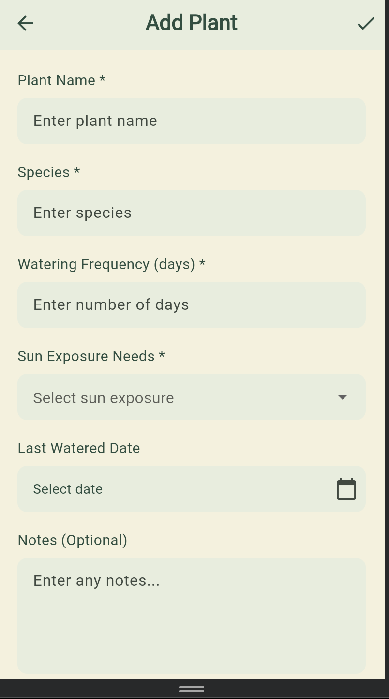
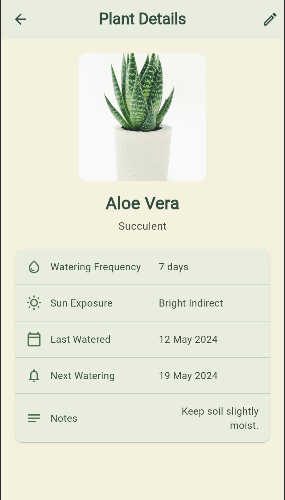
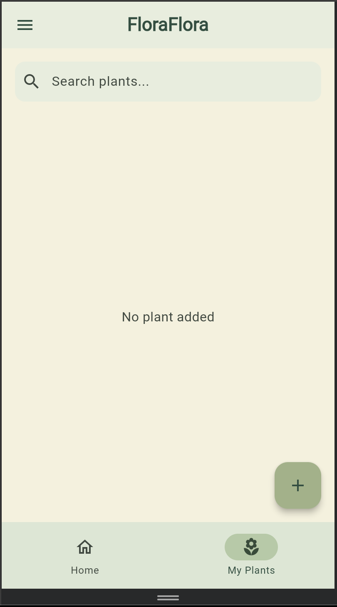

FLORAFLORA – PLANT CARE SCHEDULER

Project Overview

FloraFlora is a Flutter-based Plant Care Scheduler application designed to help users manage and track the care of their plants. The application provides a simple and user-friendly Material 3 interface where users can view plant information, search for plants, add their own plants, view detailed information, and edit existing plant records.

Assignment Requirements

This project is based on Case Study 23: Plant Care Scheduler.

The main requirements of the application are:

1. Create a Plant Care Scheduler mobile application.
2. Use a validated Flutter Form.
3. Use GlobalKey<FormState>.
4. Create a PlantCareSchedulerItem model.
5. Use Riverpod 2.0 for global reactive state management.
6. Store a List<PlantCareSchedulerItem> using StateNotifier.
7. Implement GoRouter navigation.
8. Use the required routes:
   / 
   /add
   /details/:id
9. Ensure application state persists while navigating between screens.

Technologies Used

- Flutter
- Dart
- Material 3
- Riverpod
- Flutter Riverpod
- GoRouter

Project Structure

lib/
│
├── models/
│   └── plant_care_scheduler_item.dart
│
├── providers/
│   └── plant_care_scheduler_provider.dart
│
├── routes/
│   └── app_router.dart
│
├── screens/
│   ├── home/
│   │   └── home_screen.dart
│   │
│   ├── add/
│   │   └── add_plant_screen.dart
│   │
│   └── details/
│       └── details_screen.dart
│
└── main.dart

Main Features

1. Home Screen

The Home screen displays the available plants. Each plant card contains the plant name, species, watering frequency, last watered date, and plant image.

Users can select a plant card to open its detailed information.

The Home screen also contains a search bar, add button, and bottom navigation.

2. Search

The search bar allows users to search plants dynamically.

The search works using the plant name and species. The search is case-insensitive and updates the results while the user types.

For example:

Search: Aloe
Result: Aloe Vera

Search: succulent
Result: Aloe Vera

If no plant matches the search:

No plants found

3. Add Plant

Users can add a new plant through the Add Plant screen.

The form contains:

- Plant Name
- Species
- Watering Frequency
- Sun Exposure Needs
- Last Watered Date
- Notes

Required fields are validated before the plant is added.

4. Date Validation

The Last Watered Date cannot be a future date.

For example, if today is 2 September 2026, the user can select 1 September 2026 or 2 September 2026, but cannot select 3 September 2026 or any future date.

This prevents invalid plant-care records.

5. Plant Details

The Details screen displays complete information about the selected plant.

It contains:

- Plant image
- Plant name
- Species
- Watering frequency
- Sun exposure
- Last watered date
- Next watering date
- Notes

The next watering date is calculated automatically using:

Last Watered Date + Watering Frequency

6. Edit Plant

The edit button on the Plant Details screen allows users to modify an existing plant.

When editing a plant, the existing information is automatically filled into the form.

The user can modify the information and save the changes.

The existing plant is updated instead of creating a duplicate plant.

7. My Plants

The My Plants section displays only the plants added by the user.

The predefined/sample plants are not displayed in this section.

If the user has not added any plants, the application displays:

No plant added

After adding a plant, it automatically appears in My Plants.

State Management

Riverpod is used for global reactive state management.

The main state contains:

List<PlantCareSchedulerItem>

The StateNotifier provides operations such as:

addPlant()
updatePlant()

When a plant is added or updated, the UI automatically reflects the changes.

Navigation

GoRouter is used for application navigation.

The application contains three main routes:

/
Home screen

/add
Add/Edit plant screen

/details/:id
Plant details screen

The plant ID is passed through the details route so that the correct plant information can be displayed.

UI Design

The application uses Flutter Material 3.

The design uses a nature-inspired color palette with soft green, sage, cream, and other muted natural tones.

Pure black and pure white are avoided as the main UI colors to maintain a softer and more natural plant-themed appearance.

Plant Images

Plant cards use real plant images through image URLs.

Images are loaded dynamically using network images.

If an image cannot be loaded, a plant icon is displayed as a fallback.

Application Flow

FloraFlora
    |
    v
Home
 /    \
/      \
v        v
Add Plant    Plant Details
   |              |
   |              |
   v              v
Save Plant     Edit Plant
   |              |
   v              v
Home         Update Plant
                  |
                  v
                 Home

Data Model

Each plant contains information such as:

- ID
- Plant Name
- Species
- Watering Frequency
- Sun Exposure Needs
- Last Watered Date
- Notes
- Image URL
- User Added Status

The next watering date is calculated from the last watered date and watering frequency.

How to Run

1. Open the project in VS Code or Android Studio.

2. Install dependencies using:

flutter pub get

3. Run the application using:

flutter run

The application can be tested on supported Flutter platforms such as Android, iOS, Chrome/Web, Windows, macOS, or Linux.

Testing

Home:
- Plant list appears
- Plant cards are clickable
- Search works
- No-result search displays "No plants found"

Add Plant:
- Form opens correctly
- Required fields are validated
- Valid plant can be added
- New plant appears on Home
- New plant appears in My Plants

Date:
- Past dates can be selected
- Today's date can be selected
- Future dates cannot be selected

Details:
- Correct plant information is displayed
- Next watering date is calculated correctly
- Back button works
- Edit button works

Edit:
- Existing values appear in the form
- Plant can be modified
- Updated plant appears correctly
- Duplicate plant is not created

My Plants:
- Only user-added plants are displayed
- Empty state displays "No plant added"
- Added plants appear automatically

Learning Outcomes

Through this assignment, the following concepts were practiced:

- Flutter Material 3 UI development
- Widget-based UI design
- Form creation and validation
- GlobalKey<FormState>
- Dart classes and data models
- Dart null safety
- StateNotifier
- Riverpod StateNotifierProvider
- Reactive state management
- GoRouter
- Route parameters
- Navigation between screens
- Dynamic list rendering
- Search and filtering
- Date selection and validation
- Plant data management
- Updating existing records
- Network images
- Clean Flutter project structure

Conclusion

FloraFlora provides a simple solution for managing plant-care schedules. The application combines Flutter UI development, form validation, Riverpod state management, and GoRouter navigation into a complete plant-care application.

The application supports dynamic plant data, searching, adding, viewing, and editing plants while maintaining state throughout navigation. It also validates the last watered date to prevent future dates and separates user-added plants from the predefined plant data.

## Screenshots

### Home Screen

### Add Plant Screen

### Plant Details Screen

### My Plants Screen

